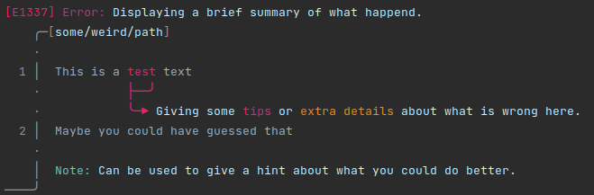

# Pretty Diagnostics

This library is able to print out a brief summary of a given error. With labels
you give exact information about what is wrong and where it is located in the
source code.

Those who like to display error messages (mostly used by compilers and 
interpreters) can now do exactly this task with a nice  result and a ease 
of use.

## Installation

Installing this library on your system is not supported yet. This will be the case
in the future, but due to the configuration designs this is not possible right now.

But what you can do instead is to install `pretty_diagnostics` as a git submodule 
and then using it by including it in your `CMake` project.

To give an example on how this could work:

Installing `pretty_diagnostics` as a git submodule:
```sh
$ git submodule add -f https://github.com/Excse/pretty_diagnostics <output directory path>
```

Including it in your existing `CMake` project:
```cmake
add_subdirectory(${PROJECT_SOURCE_DIR}/libs/pretty_diagnostics)
target_link_libraries(${PROJECT_NAME}_lib pretty_diagnostics)
```

And that's all.

## Usage/Examples

The code looks like:
```cpp
auto details = pretty_diagnostics::Details{"This is a test text\n"
                                            "Maybe you could have guessed that.",
                                            "some/weird/path"};

auto report = pretty_diagnostics::ReportBuilder ()
    .type (pretty_diagnostics::Type::ERROR)
    .message ("Displaying a brief summary of what happend.")
    .code (1337)
    .label (pretty_diagnostics::LabelBuilder ()
                    .message ("Giving some {RED}tips{/} or {ORANGE}extra details{/} about "
                                    "what is wrong here.")
                    .span ({&details, 10, 13})
                    .color (pretty_diagnostics::ColorType::RED)
                    .build ())
    .note ("Can be used to give a hint about what you could do better.")
    .build ();

report.print (std::cout);
```

The output looks like:</br>


## License

[Apache License 2.0](LICENSE.txt)

## Authors

- [@excse](https://github.com/excse)
